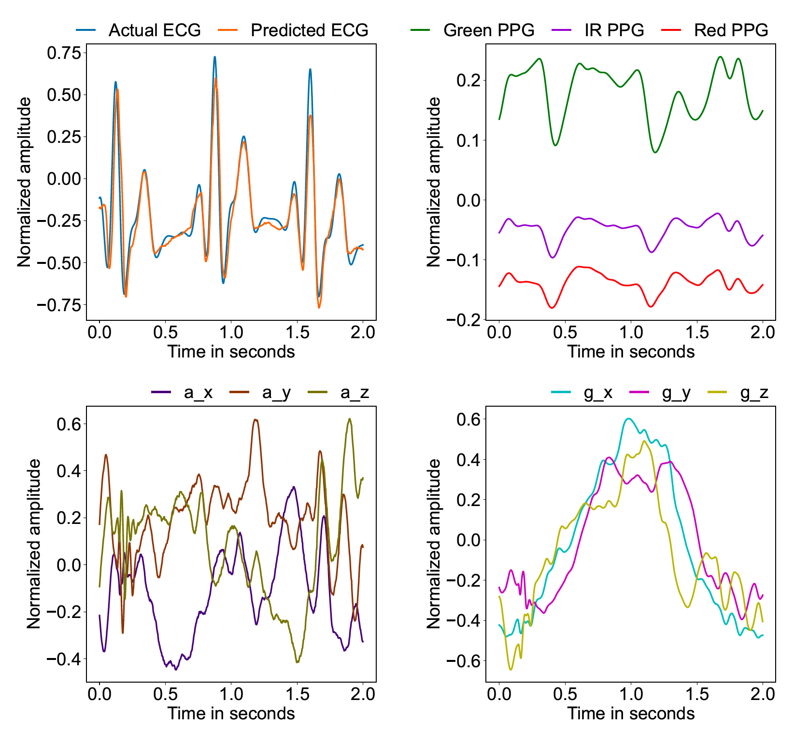

# PPG Signal Enhancement via Sensor Fusion: IMU Driven Artifact Removal Using Transformers Architecture
## Introduction
Welcome to the repository of my semester project. This project aims to develop a transformer-based architecture for robust motion artifact (MA) removal and denoising of PPG signals, by predicting the corresponding ECG signal. In the first step, the architecture utilizes a dataset of PPG signals from the finger by Mehrgardt et al. (2022), affected by MA, to train a transformer model, matching the accuracy of current state-of-the-art transformer models [1], [2]. Next, a dataset of PPG signals from the wrist with more vigorous activities is used, to compare the model’s performance on this dataset concerning the first one with relatively still activities [3]. Once this is achieved, inertial measurement unit (IMU) data is used to extend the model’s input and to compare the newly trained model’s performance to the vanilla transformer architecture in the first two steps.

This figure shows the predicted and actual ECG signals derived from the shown input PPG and IMU signals of a randomly selected sequence from the test set of the above mentioned finger dataset. It illustrates the model’s inference performance after being trained on data from a single subject of the finger dataset performing the walking activity. For a detailed analysis please refer to the report

## Folder structure
- data: Contains the datasets after the automatic preprocessing. Please download the two datasets from the official websites: https://physionet.org/content/pulse-transit-time-ppg/1.1.0/ and https://physionet.org/content/wrist/1.0.0/
- img: Contains the final figures of all training runs.
- models: Models, model summaries and all saved checkpoints are stored here.
- notebooks: Explorationary notebooks from all stages of the project.
- report: Contains the final report of the semester project.
- results: Contains the metric of all models and provisionally figures for exploratory purposes.
- scripts: Contains all scripts of the project.

Additional files:
- .gitignore: Contains untracked files, for example, the data folders.
- Environment.yml: Contains the packages from the used environment created with conda. Recreate the environment with: conda env create --name envname --file=environments.yml 
- requirements.txt: Contains the packages from the used environment created with pip. Recreate the environment with: pip install -r /path/to/requirements.txt

## Where to start
The scripts folder contains a config.yaml file to configure the model parameters. By running the main.py file the model is trained and evaluated with the set configuration in the config.yaml file. Model, model summary and checkpoints are stored in the models folder, with obtained provisionally results in the results folder. The evaluation script also creates the final figures and stores them in the img folder.

## Additional material
### Report
The report folder contains the final report of the project and explains all steps of the project in detail.

### References
1. P. Mehrgardt, M. Khushi, S. Poon, and A. Withana, “Pulse transit time ppg dataset
(version 1.1.0),” https://doi.org/10.13026/jpan-6n92, 2022, [Accessed 15-January-
2025].
2. A. L. Goldberger, L. A. N. Amaral, L. Glass, J. M. Hausdorff, P. C. Ivanov, R. G.
Mark, and H. E. Stanley, “Physiobank, physiotoolkit, and physionet: Components
of a new research resource for complex physiologic signals,” Circulation [Online],
vol. 101, no. 23, pp. e215–e220, 2000, [Accessed 15-January-2025]. [Online].
Available: https://doi.org/10.1161/01.CIR.101.23.e215
3. D. Jarchi and A. J. Casson, “Description of a database containing wrist ppg signals
recorded during physical exercise with both accelerometer and gyroscope measures
of motion,” Data, vol. 2, no. 1, p. 1, 2017, [Accessed 15-January-2025]. [Online].
Available: https://doi.org/10.3390/data2010001